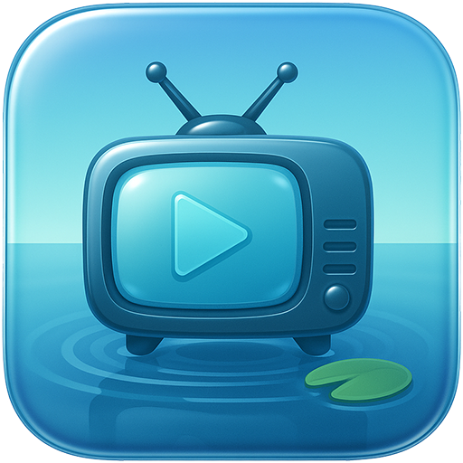

# 🌊 PondTV

<p align="center">
  
</p>

> A calm, offline alternative to streaming services—content flows from your personal collection, not an endless stream.

PondTV turns your Raspberry Pi into a plug-and-play TV channel for your media. Think of it as a dumb-TV, just like dumb-phones: no apps, no menus, just simple playback from your USB drive. Power on and watch—effortless.

## ✨ Features

- **Instant-On Playback** - Boots straight into fullscreen media
- **Smart Playlists** - Prevents binge-watching by intelligently selecting the next episode in a series
- **Channel Surfing** - Simple controls to switch content
- **Offline First** - No internet required after setup
- **Content Tracking** - Remembers what you've watched and where you left off
- **Hot-Plug Support** - Handles USB drive disconnections gracefully

## 🗂️ Preparing Your Media

Organize your files on a USB drive like this:

```
USB_DRIVE/
├── Movies/
│   └── Movie Title (Year).mkv
└── TV_Shows/
    └── ShowName/
        └── Season 01/
            └── ShowName - S01E01 - Episode.mp4
```

See the `examples/` folder for a working example you can copy.

## 🚀 Installation

Choose your preferred installation method:

### Option 1: Boot Payload (No SSH Required) ⭐

**Perfect for headless setup without keyboard/monitor**

1. **Flash Raspberry Pi OS Lite** to your SD card using Raspberry Pi Imager
   - Before writing, click the gear icon to configure WiFi credentials
2. **Download** the [boot payload](https://github.com/kdklv/pond/releases) and copy `firstrun.sh` to the boot partition
3. **Insert SD card and power on** (internet required for first boot only)
4. **Wait** for automatic installation and reboot (~5 minutes)
5. **Plug in your USB drive** and enjoy!

### Option 2: One-Command Install (SSH Required)

```bash
curl -sSL https://raw.githubusercontent.com/kdklv/pond/main/scripts/install_one_command.sh | sudo bash
```

### Option 3: Manual Install

```bash
git clone https://github.com/kdklv/pond.git
cd pond
sudo ./scripts/install_ssh.sh
```

## 🎮 Controls

| Key | Action |
|-----|--------|
| **Space** | Play/Pause |
| **→** | Next video |
| **←** | Previous video |
| **↑/↓** | Volume up/down |
| **Backspace** | Restart current video |
| **M** | Toggle mute |
| **S** | Mark as seen (skip to next) |
| **I/P** | Toggle guide |
| **Esc** | Quit |

## 🛠️ Configuration

PondTV creates a `config.yml` on your USB drive for customization. The app will generate default settings on first run.

## 🔮 Future Ideas

- **Random Mode** - Shuffle content randomly, mimicking flipping through TV channels
- **Commercial Breaks** - Insert commercials between content for nostalgic TV feel
- **Visual Effects** - Add filters and effects to playback 
- **Flashable OS Image** - Complete SD card image with PondTV pre-installed
- **Web Interface** - Manage your library through a browser
- **Multiple USB Support** - Handle content from several drives

## 🤝 Contributing

Contributions welcome! Please feel free to submit a Pull Request.

## 📄 License

This project is open source and available under the [MIT License](LICENSE).

---

**PondTV** — Your personal, offline TV channel. Simple, like still water. 